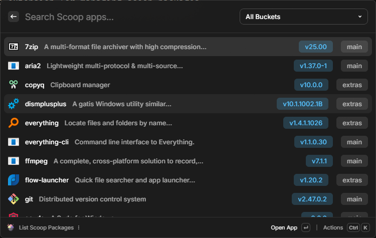

# Scoop for Raycast

A Raycast extension for managing scoop packages.



> [!IMPORTANT]
> This extension is totally for Windows users.

## Installation

This extension has not been published to the Raycast Store yet, so you need to install it manually by cloning the repository and running it in development mode.

You should have [Node.js](https://nodejs.org/en/download/) and [pnpm](https://pnpm.io/installation) installed before installing.

1. Clone this repository

```bash
git clone https://github.com/Lu-Jiejie/raycast-scoop
```

2. Go to the cloned directory and install dependencies

```bash
cd raycast-scoop
pnpm install
```

3. Install this extension in Raycast

```bash
pnpm run dev
```

4. Set your **Scoop root directory** in the extension settings.

## Usage

### Scoop List

List all installed Scoop apps.

You can easily manage them.

### Scoop Search

Search for Scoop apps.

Choose an app to install it.

## Thanks

- [Flow.Launcher.Plugin.Scoop](https://github.com/xavialyra/Flow.Launcher.Plugin.Scoop)
